# CS 246 Notes

## Table of Contents

- [3 Points of View](#3-points-of-view)
- [Hello World](#hello-world)
- [Streams](#streams)
- [Dealing with Erroneous Input](#dealing-with-erronenous-input)
- [Strings](#strings)
- [Overloading](#overloading)
- [Structs](#structs)
- [Constants](#constants)
- [Parameter Passing](#parameter-passing)
- [References](#references)
- [Dynamic Memory Allocation](#dyanmic-memory-allocation)
- [Returning by Value, Reference and Pointer](#returning-be-value-reference-and-pointer)
- [Operator Overloading](#operator-overloading)
- [Overloading I/O Operators](#overloading-io-operators)
- [Compile Bash Script](#compile-bash-script)
- [Default Constructor](#default-ctor)
- [The Big 5](#the-big-5)
  - [Copy Constructor](#copy-ctor)
  - [Destructor](#destructors)
  - [Copy Assignment](#copy-assignment)
  - [Copy/Swap Idiom](#copyswap-idiom)
- [Move Semantics](#move-semantics)
- [Object Creation](#object-creation)
- [Elision](#elision)
- [Member Operations](#member-operations)
- [Object Arrays](#object-arrays)
- [Constant Objects](#constant-objects)
- [Constantness of an Object](#constantness-of-an-object)
- [Static](#static)
- [Object Comparison](#object-comparison)
- [Invariants and Encapsulation](#invarients-and-encapsulation)
- [Iterator as an Idiom](#iterator-as-an-idiom)
- [Templates](#templates)

### 3 Points of View

- programmer: write correct code, prevent bugs (cppreference.com)
- compiler: how are "structures" put together
- software engineer: how to design code (classes and their relationships)

**Note: C++ requires that code be compiled in dependancy order**

### Hello World

```c
/* hello.c */
#include <stdio.h>
int main() {
    printf("hello world\n")
    return 0;
}
```

```cpp
/* hello.cc */
import <iostream>; // ; required
int main() { // main must return int in cpp
    std::cout << "hello world" << std::endl;
    return 0; // optional, done by default
}
```

Note:

- endl is a "\n" (newline) and a request to flush output buffer
- namespace::name is a namespace resolution operator

### Streams

std::cin

- standard input
  eg. int x; std::cin >> x;

std::cout

- standard output
  eg. std::cout << "x = " << x;

std::cerr

- standard error
  eg. std:cerr << "oops!";

> **They are global variables in "std" namespace**
> (cin is an object i.e. and instance of std:istream (input stream) cout/cerr are instances of std::ostream (output stream))

Direct of arrows <</>> indicates info flow

- towards stream => output
- towards variable name => input

CPP allows for "overloading". We can have functions with the same name and different signatures. The compiler will determine which function implimentation to use based on the types of the inputs. Return types are not considered.

### Dealing with erronenous input

All stream objects have bits: good, bad, fail, eof.
Cannot be accessed directly but can use methods to access them.

> Tip 1: must read before test the stream state bit.

```cpp
int i;
cin >> i;
if (cin.good()) cout << i << endl;
```

> Tip 2: reaching the end of the file (EOF) sets both the fail and eof bits in the stream object

Remember that `>>` returns an istream. i.e. `std::istream& operator >> (std::istream& in, int& value)`
Or we can use the `!` operator on a istream to call the `fail()` method.

```cpp
while (true) {
  cin >> i;
  if (!cin) break;
  cout << i << endl;
}
```

`std::istream` also provides a method : operator `bool()` const

- Defined as calling !fail()

```cpp
while (cin >> i) {
  cout << i << endl;
}
```

This structure doesn't make a difference between the EOF and fail condition.
Both terminate the while loop.

```cpp
while (true) {
  cin >> i;
  if (cin.eof()) break;
  if (cin.fail()) {
    cin.clear(); // reset state bits first so can read
    cin.ignore(); // reads and throw away one char of info
  } else {
    cout << i << endl;
  }
}
```

### Strings

A C-style string is an array of char, either `char*` or `char[]`.

- Manual memory manangment need to resize string.
- Must be terminated by `\0` (termination charecter).
- Very error prone.
- strlen() is O(n)

C++ strings

- must `import <string>;`
- `std::string` (class)
- handles memory managment automatically!
- `size()` and `length()` methods are O(1)

eg

```cpp
string s1; // s1 = "" length is 0
string s2 = "hello"; // (const char*) c-style
string s3 {"world"}; // s3 = "world"

cout << s3[0] << s2[1]; // outputs: we
cin >> s1; // Reads a sequence of charecters until it hits EOF. (This is the only way to fail)
cout << s2 << ' ' << s3 << endl;

s1 = s2 + s3; // s1 = "helloworld"
s1 += s2; // s1 = "helloworldhello"
```

- string also defines stand-alone `getline` function
- reads from current position in input stream to `\n`, which is thrown away
  `std::istream& getline(std::istream& in, std::string& s);`

```cpp
std::string line;
while (getline(std:cin, s)) {
  cout << line << endl;
}
```

**Note: a "stream" is an abstraction that wraps the concept of reading and writing data**

Other kinds of streams:

- Files also have a stream abstration `import <fstream>;`
  -- `std::ifstream` for input and `std::ofstream` for output
  -- eg trys to open in read mode

  ```cpp
  std::ifstream in{"input.txt"};
  if (in.fail()) return 1;
  int i;
  while (in >> i) {
    cout << i << endl;
  }
  // file is closed when in goes out of scope
  ```

```cpp
std:istream *inptr = &std::cin;
if (something) {
  inptr = new ifstream{"input.txt"};
}

if (inptr != &cin) delete inptr;
```

- String streams
  --`import <sstream>;`
  -- Initialize as a string then read from it as if it was an input string
  --

  ```cpp
  int score = 0;
  ostringstream out;
  out << "Your score is " << score;
  display(out.str());
  string line = "  \t23 -5 999";
  istringstream in{line};
  int i;
  while (in >> i) {cout << i << endl;}
  ```

```cpp
string s; int i;
while (cin >> s) {
  istringstream iss{s};
  if (iss >> i) cout << i << endl;
} // we dont need iss.clear() and iss.ignore(), every iteration creates a new iss object so this is unnessacry
```

This is the only way we know how to convert a string to an int. (A2)

C++ 20 feature

```cpp
while (cin >> s) {
  if (istringstream iss{s}; iss >> i)
    cout << i << endl;
}
```

**Notes: When a istream gets corerced to a boolean, we are invoking the !fail() method**

I/O Manipulation

- output formatting via "manipulators"
- changes output streams state
- change persists unless you set it back
- best practise to reset state to origonal once done with it
- `import <iomanip>;` part of std namespace
- `skipws/noskipws` skipws is on by default. If you want to read every charecter you might want to turn this off.
- `setw(3)` sets the width of the output
- `setfill(0)` sets fill charecter
- other booleans `hex`, `dec`, `oct`, `boolalpha`

Command-line arguments

- options given as part of the command to execute a program
- don't consider the program name as a command line argument

```bash
wc -l -w < input.txt 1>out.txt 2>err.txt
```

Shell handled removing the piping I/O. Program never sees where I/O gets piped.
`-l`, `-w` are command line args. Access uses the C mechanism.

```cpp
int main(int argc, char* argv[]) // (Number of strings, array of C-style strings)
argv = ["wc\0", "-l\0", "-w\0", nullptr];
```

```cpp
if (argv[1] == "-l\0") // not valid comparison. just comparing pointer addresses

string arg = argv[1];
if (arg == "-l\0") // better to coerce to c++ string first rather than working with c-style strings
```

```cpp
int main(int argc, char* argv[]) {
  int total = 0;
  for (int i = 1; i < argc; ++i) {
    string s{argv[i]};
    int val;
    if (istringstream{s} >> val) total += val; // A2
  }
  cout << "total = " << total << endl;
}
```

### Overloading

C++ allows for non-unique function names (overloading)

```cpp
// c
int negInt(int v);
double negDouble(double d);
// cpp
int neg(int v);
double neg(double d);
```

Return type is not part of that consideration. The compiler examines set of function with that name,
looking for closest match based on number of parameters and their types.

```cpp
void printSuite(string filename) {
  ifstream in{filename};
  string s;
  while (in >> s) cout << s << endl;
}

int main(int argc, char* argv[]) {
  string filename = "suite.txt";
  if (argc > 1) filename = argv[1];
  printSuite(filename)
}

// Consider overloading printSuite
void printSuite() {
  ifstream in{"suite.txt"};
  string s;
  while (in >> s) cout << s << endl;
}

// Now main changes to be
int main(int argc, char* argv[]) {
  if (argc > 1) printSuite(string{argv[1]});
  else printSuite();
}

// Or better version of printSuite
// Default params must be last in the list of params, with no "gaps"
void printSuite(string filename="suite.txt") {
  ifstream in{filename};
  string s;
  while (in >> s) cout << s << endl;
}
```

If implimentation is in a seperate file then **DO NOT** put default values there.
Compiler needs to know at calltime if there are default values so that they can be pushed onto the runtime call stack => info comes from interface.
Then, when function executes, retirves all parameter values from the stack (including default) so doesnt accenditaly read incorrect subsequent values.
TODO: Add more here

### Structs

- backwards compatiable with C

```cpp
struct Vec {
  int x, y;
};

Vec v1; // Undefined behavior
Vec v2 = {0, 1}; // v2.x == 0, v2.y == 1
Vec v3{-1, 0}; // Valid syntax  well
v2.x = 3;

// C
typedef struct node {
  int value;
  struct node* next;
} Node;

Node n{12, nullptr};

// C++
struct Node {
  int value;
  Node* next;
};

// C++
struct Node {
  int value;
  Node next;
};
// Why is this wrong?
// "declaration before use"
// Compiler doesn't know how much space to allocate for next field
// We are in the middle of defining Node, therefore we don't know how much space to allocate.
// We must define something with a known fixed size, so we use a pointer because they are always 8 bytes.

// Must be a pointer, becasue pointer is known at compile time

Node n{13, nullptr};
```

### Constants

Give numeric values a name that is meaningful.

```cpp
const int MAX_GRADE = 100;

Node n{5, nullptr};
const Node n2 = n; // n2{n}

// n2 is immutable and cannot be changed and is a copy of n
```

Best practise to make immutable items wherever possible.
Let the compiler help you.

### Parameter passing

```cpp
void inc(int n) { ++n; }
// Parameter n is a copy of the value passed in
// Changes made to n are made to the copy, not the origenol
// "pass by value"

int main() {
  int x = 5;
  inc(x);
  cout << x << endl;
}
```

```cpp
// C fix to previous code
void inc(int* n) {
  ++(*n);
}

int main() {
  // ...
  inc(&x);
  cout << x << endl;
}
```

lvalue: something that can appear on the left hand side of an assignment statment.
ie something that has a name or can be accessed by a C++ reference or by dereferencing a pointer.
rvalue: are usually temperary objects often returned by value from a function, could also be an annonomous object.

### References

C++ provides an "lvalue reference"

```cpp
int x = 10;
int& z = x; // z is an lvalue reference to x
z = -1; // the value x is now -1
x += 2; // z will display 1

int* const pi = &x;
*pi = 5;
```

```cpp
void inc(int& n) {++n;}
int x = 5;
inc(x);

// Didn't have to take the address of x when calling inc. Less opportunity for error.
```

**If the ampersan is part of the type name `Node&`, then it is a lvalue reference. Otherwise you are taking the address of something or doing some sort of bitwise operation.**

Things you cannot do with lvalue references:

- Cannot leave it uninitialized `int x = 5; int& y = x;`
- Cannot create a pointer to a reference but can have a reference to a pointer

```cpp
int*& x; // legal (referance to a pointer)
int&* x; // illegal (pointer to a reference)
```

- Cannot have a referene to a reference
- Cannot have array of references (doesn't compile)

Remember `cin >> x;`
Why didnt we have to take the address of x to change the value of x? Why I could read more than 1 value from cin in succession.

The operator>> signature uses lvalue references.
`std::istream& operator>>(std::istream& in, int& value);`

What does it mean to return by reference?
First need to consider cost of passing information around.

```cpp
struct ReallyBig {...}; // Really big, large cost associated
int f(ReallyBig rb); // passed by value so make a copy which is expensive (space/time)
int g(ReallyBig* rb); // passed by address so value copies 8 bytes
int h(ReallyBig& rb); // passed by lvalue reference, copies constant pointer
// h might change contents of rb,
int j(const ReallyBig& rb); // rb contents cannot be changed
```

What if function wants to change rb but not have the changes effect the origonal, we would need to make a local copy.

```cpp
void foo(ReallyBig& rb) {
  ReallyBig myrb = rb;
  // myrb is a copy of rb
}
```

Had to make a copy anyways so might as well just pas by value.

Best practise is to pass by constant lvalue reference over passing by value if element is larger than a pointer (8 bytes), unless you have to make a copy anyways. Compiler may be able to optimize by passing by value.

```cpp
int f(int& n);
int g(const int& n);

f(5); // wont compile since f's parameter implies value can change
g(5); // this works
```

Compiler creates temp location in memory to hold the literal 5, and binds lvalue reference n to that location.

Going back to `operator>>`. `std::istream&` as both a parameter and return vlue avoids the cost of copies a stream since streams cannot be copied in C++.

### Dyanmic Memory Allocation

C's malloc requires the size of the object you wanna allocate.

```cpp
int* i = malloc(100 * sizeof(int));
// ...
free(i);
// Not type safe since all allocation/free routines work will (void*)

// C++ introduces 2 new keywords, new and delete, that are typesafe and thus less-error-prone
int* i = new int{-198} // heap allocation for an int
delete i;
// deleting i doesn't set it to nullptr
*i = 99; // may seg fault or not
i = nullptr; // guarenteed segfault

Node* ptr = nullptr;
delete ptr; // does nothing
ptr = new Node{4, new Node{5, nullptr}};
delete ptr->next;
delete ptr; // memory leak since only deleted first node

Node** arrptr = new (Node*)[100]{nullptr};
// All 100 (Node*) are set to nullptr
delete [] arrptr; // if created with new
```

### Returning be value, reference and pointer

```cpp
Node getNode(int value) {
  Node n{value, nullptr};
  return n;
}
```

- Node is being returned by value => making a copy

```cpp
Node* getNode(int value) {
  Node n{value, nullptr};
  return &n;
}
// Returns adress of local var, dangling pointer!

Node* getNode(int value) {
  return new Node{value, nullptr};
}
// caller must remember to delete it later

Node& getNode(int value) {
  Node n{value, nullptr};
  return n;
}
// returns lvalue ref but n is destroyed when the function executes


Node& getNode(int value) {
  Node* n = new Node{value, nullptr};
  return *n;
}
// lvalue ref bound to heap-allocated object
// caller would have to use delete, which isn't obvious

Node& getNode(int value) {
  Node* n = new Node{value, nullptr};
  return *n;
}
```

Given a choice, whaty should you return?

- Return by value is usally the best choice, since it turns out not to be as expensive as you think.

**See concept of elision later!**

### Operator overloading

Already saw this with stream >> and <<.

```cpp
struct Vec{int x, y;};

Vec operator+(const Vec& x, const Vec& y) {
  return Vec{x.x + y.x, x.y, + y.y};
}

Vec operator*(const Vec& v, int s) {
  return Vec{v.x * s, v.y * s};
}

Vec v1{0,1}, v2{2,3}, v3;
v3 = v1+v2;
v3 = v1 * 2; // Can also redefine the * operator
```

### Overloading I/O operators

- Since streams cant be copied and are modified, pass by (non-const) reference
- Since always to left of operator first paramerter of parameter-lsit

```cpp
struct Grade {int value;};
istream& operator>>(istream& in, Grade& g) {
  in >> g.value;
}
```

### `compile` Bash Script

- file `syslibs.txt` contains list of system libraries to compile
- first argument is `order.txt` (list of your file deps to compile in order)
- options second arg, name of execuable (defaults to `a.out`)
- optional third arg, link in a system libray (A4)
- compiles then links

```cpp
Student s = Student{60, 70, 80};
```

What is going on here? Looks like an rvalue is created and assigned to s, but this is false. Equivilemnt to `Student s{60,70,80}` but thats not what happening either.
What its doing is ellision, we will get more into this later.

**Note: a "default" constructor has 0 parameters.**
A constructor is called every time an object is declared. If no constructor is definened the compiler automaticaly defines a constuctor.

### Default ctor

```cpp
struct Point {
    int x;
    int y;
};

Point p;   // OK: compiler-generated default constructor

struct Point {
    int x;
    int y;

    Point(int x_, int y_) : x(x_), y(y_) {}
};

Point p;   // ❌ ERROR: no default constructor

struct Point {
    int x;
    int y;

    Point() : x(0), y(0) {}
};
Point p;   // OK, x=0, y=0

struct Point {
    int x;
    int y;

    Point() = default; // This line is redundnat, works like I never declared it.
};

struct Point {
    int x;
    int y;

    Point() = delete;
    Point(int x_, int y_) : x(x_), y(y_) {}
};

Point p;        // ❌ compile error
Point q(1, 2);  // OK

struct Example {
    int x;               // uninitialized
    std::string name;    // default-constructed (empty string)
};
```

The compiler will call the default constructor for any fields of an object which are classes.

Object creation steps:

1. Allocate space for entire object
2. Allocate data fields in declaration order (but stored in stack order) (compiler provided default ctor calls default ctor for object fields)
3. Run ctor body

Need out ctor calls for `Vec` to be in step 2 since step 3 is too late.
We'll use the "memeber initialization list" (MIL) to accompish this.

**Note: We can only use this in construcotrs.**

```cpp
struct Basis {
  Vec v1, v2;
  Basis();
};

// Basis-impl.cc
Basis::Basis() : v1{0,1}, v2{1,0} {} // datafield{parameters}
```

When must you use MIL?

- It must be used for non-default ctor calls.
- Constants
- References

C++ lets us initialize values inline. So which takes precedence, MIL or inline initilaization?

```cpp
struct Vec {
  int x=0, y=1;
  Vec() {} // Uses both inline values
  Vec(int i) : x{i} {} // Uses MIL for x but inline for y
  Vec(int x, int y) : x{x}, y{y} {} // Uses MIL for both
};

Vec v1{4}; // 1-param ctor
Vec v2 = 4; // 1-param ctor

void f(Vec v);
f(v1);
f(4); // Calls 1-param ctor
```

```cpp
struct Basis {
  //...
  Basis(const Vec& v1, const Vec& v2) : v1{v1}, v2{v2} {} // Copy constructor
}

struct Vec {
  int x, y;
  Vec(int x, int y);
  Vec(const Vec& v): x{v.x}, y{v.y} {};
}
```

Note compiler does exaclty the same thing in its provided copy ctor (if you havn't written your own)

### The Big 5

To control how objects are created, write a constructor (ctor). Constructors have no return type and have the same name as the class/struct.

1. Copy ctor
2. Move ctor
3. Destructor
4. Copy assignment
5. Move assignment

#### Copy ctor

```cpp
// student.cc
export struct Student {
    int assns, mt, final;
    string name;
    Student(const Student &s): assns{s.assns}, mt{s.mt}, final{s.final}, name{s.name} {} // The compiler does this automatically
}
```

When is this insufficient?

```cpp
struct Node {
  int data;
  Node* next = nullptr;
}

Node* n = new Node{1, new Node{2, new Node{3}}}

// n -> | stack | -> | heap |
Node n2 = *n;
Node *nptr = new Node{*n};
n->next->data = 15;
// all three lists have 2nd node with data = 15
```

Compiler provided copy ctor preforms shallow copy copies numeric values of pointers rather than "deep" copy. So it creates new values

```cpp
struct Node {
  int data;
  Node* next = nullptr;
  Node(const Node& other) : data{other.data}, next{other.next == nullptr ? nullptr : new Node{*other.next}}
}
```

```cpp
struct Node {
  int data;
  Node *next;
  Node(Node other); // This is wrong. 'other' is being passed by value, copy call makes infinite recursion.
}
```

Param for a copy ctor always pass by reference.

#### Destructors

NEVER have a return type. No parameter. Ever.

Called when stack-allocated object goes out of scope or if heap allocataed when use delete on it.

```cpp
Node n{1, new Node{2, new Node{3, nullptr}}};
Node *ptr = new Node{n}; // copy ctor
// ...
delete ptr;
```

Compiler-provided destuctor invokes destructor for all object data fields.
Must define a dtor for `Node`.

```cpp
struct Node {
  // ...
  ~Node() {
    delete next;
  }
}
```

Destructors "clean up" all managed resources if considered responsible for that resource. eg. close files, network connections, release heap memory.

#### Copy Assignment

```cpp
*ptr = n; // copy assignment
```

- Return type by lvalue reference.
- Not constant, you might potentially change it.
- Parameter should be a `const X&`, where `X` represents some type.

```cpp
struct Node {
  Node& operator=(const Node& rhs) {
    data = rhs.data;
    // next = rhs.next;   This is bad for two reasons. Leaked memory from this->next. 
    // And doing a shallow copy which is a bad.
    return *this;
  }

  // v2
  Node& operator=(const Node& rhs) {
    data = rhs.data;
    delete next;
    next = new Node{*rhs.next}; // copy ctor
    return *this;
  }
}
```

What about self assignment? `n = n;`
Attempts to deep copy with a dangling pointer.

Is `*this == rhs` correct? Nope. Compiler doesn't give us this for free.

Another issue, if heap allocation fails during the deep copy. We already freed `this->next` pointed to.

```cpp
  // v2
Node& Node::operator=(const Node& rhs) {
  if (this == &rhs) return *this; // self-assignment test
  Node *tmp = rhs.next == nullptr ? nullptr : new Node{*rhs.next}; // if fails, returns
  delete next;
  data = rhs.data;
  next = tmp;
  return *this;
}
```

##### Copy/Swap Idiom

- "idiom" is a progamming language level solution to a commmon problem.

1. Write a helper swap method
2. Leverage copy ctor then use swap

```cpp
import <utility>; // std::swap

struct Node {
  int data;
  Node *next;

  void swap(Node &other) {
    std::swap(data, other.data);
    std::swap(next, other.next);
  }

  Node& operator=(const Node& other) {
    Node tmp{other}; // Node tmp = other; // local deep copy
    swap(tmp); // excahnges *this with tmp
  } // tmp goes out of scope which calls the destructors on the other Node's
}
```

On exam, know Copy/Swap idoim and v4.

What about case where = RHS is an rvalue, not an lvalue?

```cpp
Node generateSLL();
Node n ...;
n = generateSLL(); // generateSLL returns an rvalue

// or

Node n2 = generateSLL();
```

Rather than doing a deep copy the rvalue that is about to be destroyed. We can "steal" the rest of the list.
We can introduct "move" semantics.

move ctor and move = use an "rvalue" reference as the parameter.

### Move semantics

lvalue - can appear on the LHS of =
       - has name and/or can be accessed by an lvalue reference or dereferencing a pointer.

rvalue - usually a temporary object (returned by value); could be anoymous obejct

```cpp
Node getList() {return Node{1, new Node{2, new Node{3, nullptr}}}};
Node n = getList(); // 6 Copy constructor calls if no elision
                    // with alision, since list is known, 0 copy ctor calls

```

**Note: temperary rvalues will be destroyed at the statment end anyways.**
=> "Steal" data rather than copy.
=> tell compiler by using "rvalue references"
=> an rvalue reference uses &&
`Node&& n = oddsOrEvens();`
=> move operations therefore use && on parameters

```cpp
// Node move ctor
Node::Node(Node&& other): data{other.data}, next{other.next} {
  other.next = nullptr;
};

// Node move ass
Node& Node::operator=(Node&& rhs) {
  swap(rhs);
  return *this;
}
```

Q: Do we need a self assignment test?  
A: Probably not for a simple data structure but maybe for more complex ones `unique_ptr`.

```cpp
n = std::move(n);
```

If we don't write move semantics then copy operations get used instead. Worse case its less efficient.

Study hack:

- compile under c++14 standard

1. Change "import <...>" to "#include <...>"
2. g++ -std=c++14 -fno-elide-constructors vec2.cc

### Object creation

1. Allocate space for object
2. Init struct data fields (default ctor or MIL ctor calls)
3. Run ctor body

Then for destructors

1. Run dtor body
2. Destroy object data fields (run dtors) => reverse creation order
3. Free the object memory

### Elision

As of c++11, the compiler is required to preform elision. Not use move or copy ctors but rather copy data byte wise.

**Best practise: once you write one of the big five, evaluate whether to write all 5. For some classes (Vec, Student) the compiler provided are good enough.**

### Member operations

5 operators must be class methods:

1. = (assignment)
2. -> (deference and go to)
3. () (function objects)
4. operatorT (type coercison to "T")
5. [] (index operator)

I/O operators should not be members of the class.

```cpp
struct Node {
  // ...
  ostream& operator<<(ostream& out);
  // ...
}

cout << n; // not correct
n << cout; // correct
```

Leads to counter intuitive code so always write as stand alone functions.

- all other operators are a choice, just be consistent!
Best practise: if writing arithmatic operators also impliment self-assignment version (write self assignment first, use to impliment others)

```cpp
Vec v1, v2;
cout << v1 + v2;
v1 += v2;

Vec& operator+=(Vec& v1, const Vec& v2) {
  v1.x += v2.x;
  v1.y ++ v2.y;
  return v1;
}

Vec operator+(const Vec& v1, const Vec& v2) {
  
}
```

**Note: operators . and * can neither be overloaded nor overridden (see "inheritance later").**
In addition to being able to specify that the default (compiler version) of a method (default ctor, dtor, move/copy, ctor, move/copy) prohibit use of certain method

```cpp
class std::ostream ... {
  std::ostream(const std::ostream&) = delete;
  // ...
}; // std::ostream deosnt allow move/copy
```

### Object Arrays

```cpp
struct Vec {
  int x, y;
  Vec(int x, int y) : x{x}, y{y} {};
};
```

Since no default ctor, the following are all compilation errors:

```cpp
Vec a1[5]; // error, no default ctor
Vec *a2; a2 = new Vec[5] // also error
Vec a3[5]{Vec{0,1}}; // Error
Vec a4[5]{0,1}; // Error
```

Options

1. Add default constructor, but may not be possible in all situations.
2. Initialize array elements individually.

```cpp
Vec arr[3] = {Vec{0,0}, Vec{1,1}, Vec{2,2}} // Size of array must match number of items
```

1. Whether it is on the stack or heap make it an array of `(Vec*)`.

```cpp
Vec* a1[10]{nullptr};
for (int i = 0, i < 10; i++) {
  delete a1[i]; // Or initialize each element
}

int size = 0;
cin >> size;
Vec** a2 = new Vec*[size]{nullptr};
a2[5] = new Vec{1, 1};
// Loop over and delete each allocated 
delete []a2;
```

### Constant objects

What is a constant obejct? One whose fields are immutable.

```cpp
Student sue{60, 70, 80};
const Student bob = sue;
```

More commmonly see parameters that are constant objects.

```cpp
ostream& operator<<(ostream& out, const Student& s) {
  out << s.grade(); // Causes compilation error. s.grade() might modify the fields of s
  return out;
};
```

We can make grade a "contstant" method. Note: we can overload methods by making them const methods.

```cpp
struct Student {
  float grade() const;
}

// student-impl.cc
float Student::grade() const {

}
```

(Exam/midterm) Which takes precidence, MIL or default field initilization? MIL!

### Constantness of an object

- The physical constantness of an object is interested in whether or not any obejct bits have changed.
- The logical constantess of an object looks at what conceptually makes up the object (eg grades and name for Student) and if those have changed
  => Declare as mutable if not part of logical constness
  => Constant mehtods allowed to change mutable data fields.

Constant methods can only call other constant methods.
Non-constant methods can only call other non-constant methods.

Make methods const when applicable.

### Static

A `static` data field is shared across all instances of the class.
If no object exists, can use a static method to access and or modify.
=> Once have objects, non-static methods can use static data fields.

```cpp
// Old apprach
struct Student {
  static int numObjs;
  static int getNumMethodCalls() {return numMethodCalls;}
  Student(...): ... {
    ++numObjs;
  }
}

int Student::numObjs = 0;

// New way
struct Student {
  inline static int numObjs = 0;
  // ... Same as above
}

cout << Student::getNumObjs() << endl; // 0
Student sara{60,70,80};
cout << Student::getNumObjs() << endl; // 1
```

### Object comparison

**Note: do not get operators == and != for "free" from the compiler (exept see <=>)**

```cpp
struct Vec {
  int x, y;
  bool operator==(const Vec& rhs) const {
    return (x == rhs.x && y == rhs.y);
  }
};
```

```cpp
string s1, s2;
if (s1 < s2) {

} else if (s1 == s2) {

} else {

}
```

Worse case scenario 2 order n comparisions. C is more efficient!

```cpp
int retValue = strcmp(s1, s2); // Asume (char*)
if (retValue < 0) {

} else if (retValue == 0) {

} else {
  
}
```

Worse case 1 order n comparision. Everythign else is constant.

```cpp
import <compare>; // We can import <=>

// Operator <=> returns std::strong_ordering:: less greater equal equvilent (must be compared in relation to 0)

auto result = s1 <=> s2;
if (result < 0) {

} else if (result == 0) {

} else {

}
```

```cpp
auto operator<=>(const Vec& lhs, const Vec& rhs) {
  auto result = lhs.x <=> rhs.x;

  if (result != 0) return result;
  return lhs.y <=> rhs.y;
}
```

When we impliment the <=> operator for an obejct, we automatically get <, <=, >, >=, != ==. For example (v1 <=> v2 > 0).

When is default lexicogragphical comparison for <=> inadaquate?
Comparison of Node objects (ie next contains memory addresses so <, > not meaningful.)

```cpp
struct Node {
  int data;
  Node *next;
  auto operator<=>(const Node& other) const {
    auto res = data <=> other.data;
    if (res != 0) { // this and other have different data fields
      return res;
    }
    if (!next && !other.next) { // this->next and other.next are nullptr 
      return res; // must be equal
    }
    if (!next) { // this is shorter than other so return less
      return std::strong_ordering::less;
    }
    if (!other.next) { // this is longer than other so return greater
      return std::strong_ordering::greater;
    }
    return (*next <=> *other.next);
  }
}

// first compare the data fields of the two nodes
```

### Invarients and Encapsulation

```cpp
Node n1{1, new Node{2, new Node{3, nullptr}}};
Node n2{1, nullptr};
Node n3{2, &n2};
// runtime error when Node destructor of n3 calls delete next on stack allocated n2
```

Invarient: statment about the class that must always be true for the life of the object
e.g: `Node`'s next data field either contians `nullptr` or a valid, unshared, heap address.
Stack: last item "pushed" is first item "popped".
Problem: client (code) can direclty access and change data fields.
Solution: Encapsulate data fields in a black box sealing them away so client can only interact.

```cpp
// Wrap Node in List class
struct List {
  private:
    struct Node {
      // ...
    }
    Node *head = nullptr;
  public:
    ~List() {delete head;}
    void addToFront(int val) {head = new Node{val, head}}
    int ith(int idx) const {
      int ctr = 0;
      Node *ptr = head;
      for (; ptr && ctr < idx; ++ctr, ptr = ptr->next);
    }
}
```

By default struct has public accessibility/visibility.
=> would prefer default to be private
=> use `class` keyword

Best practise to use `class` keyword as much as possible.
Exception might be a class with only data eg Node. (nested class)

**Note: nested class can see/use anything static in outer class, even if declared private.**

Given an instance of the outer class (or pointer reference), can access/use anything from the outer class, even private data/methods.
Problem with List traversal now encapsulating Node traversal of entire List of n nodes is O(n^2)

### Iterator as an idiom

```cpp
List mylist;
mylist.addToFront(3);
mylist.addToFront(2);
mylist.addToFront(1);

List::Iterator it = mylist.begin();
while (it != mylist.end()) { // .end() returns true if gone past the last item
  cout << *it << endl; // output value
  ++it; // move iterator
}


// new class List
class List {
  // ...
  public:
    // ...
    class Iterator {
      Node *ptr;
      public:
        Iterator(Node *ptr): ptr{ptr} {}
        int operator*() const {
          return ptr->data;
        }
        bool operator!=(const Iterator& other) const {
          return ptr != other.ptr;
        }
        Iterator& operator++() {
          ptr = ptr->next;
          return *this;
        }
    }
    Iterator begin() const {
      return Iterator{head};
    }
    Iterator end() const {
      return Iterator{nullptr};
    }
}
```

Problem: need `List::Iterator` type to be public, but its constructor is also public.

```cpp
List::Iterator it{3};// this is bad, dont want this to happen
```

Solution, make ctor private.
=> but now List cant call it either!

Solution: make List a `friend` of Iterator. (could just be the begin/end methods)
=> can access everything

```cpp
class List {
  public: 
    class Iterator {
      friend class List;
      Node *ptr;
      Iterator(Node *ptr): ptr{ptr} {}
      public:
        // ...
    }
}
```

### Range based for loops

```cpp
for (List::Iterator it = mylist.begin(); it != mylist.end(); ++it) // ...
for (auto n : mylist) cout << n << endl; // n is the dereferenced iterator
// n is a copy of the information returned 

for (auto& n : mylist) ++n; // Actual modify list if Interator implimentation returns by reference instead of value
```

Range based for loops use "duck typing".
=> can use any class that has a `begin` and `end` method that returns an iterator.

### Encapsulation

`class` keyword has default visibility of private.
C++ `friend` keyword breaks encapsulation entirly, friends can see everything from the other class.
The alternative is to use getters and setters (accessors and mutators).
The solution is that stand alone function friends.

```cpp
class Vec {
  int x, y;
  public:
    Vec(int x = 0, int y = 0);
    int getX() const {return x;}
    // ...
    void setX(int x);
    // ...
}

istream& operator>>(istream& in, Vec& v) {
  int x, y;
  in >> x >> y;
  v.setX(x);
  v.setY(y);
  return in;
}

ostream& operator<<(ostream& out, const Vec& v) {
  return out << "(" << v.getX() << // ...
}
```

Alternative approach

```cpp
class Vec {
  friend std::istream& operator>>(std::istream&, Vec& );
  friend std::ostream& operator<< // ...
  int x, y;

  public:
    // ...
}

istream& operator>>(istream& in, Vec& v) {
  return in >> v.x >> v.y;
}
ostream& operator<<(ostream& out, const Vec &v) {
  return out << "(" << v.x // ...
}
```

### Equality Revisited

How shoudl we determine the # of `Node` objects in the list. Want a `List::size()` method.
=> Cost is 4 bytes + 1 extra operation

Side effect: can use the counter to write == (or !=) and determine inequality with 1 comparison.

```cpp
auto operator<=>(const List& o) const {
  if (!theList && !o.theList) return std::strong_ordering::equal;
  if (!theList) return std::strong_ordering::less;
  if (!o.theList) return std::strong_ordering::greater;
  
  return *theList <=> *o.theList;
}

bool operator==(const List& o) const {
  if (numNodes != o.numNodes) return false;
  return *this <=> o == 0;
}
```

### System Modeling

- Using "Unifired Modeling Language" (UML)
- focus on a simplified version

A class is a box.

- Language agnositc

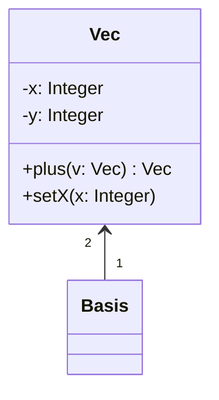

In general in this course, we do not write ctors, dtors, accessors, mutators since it is expected that they are provided.
Class relationships simplist form is "association", which only tells us that there is a relationship.

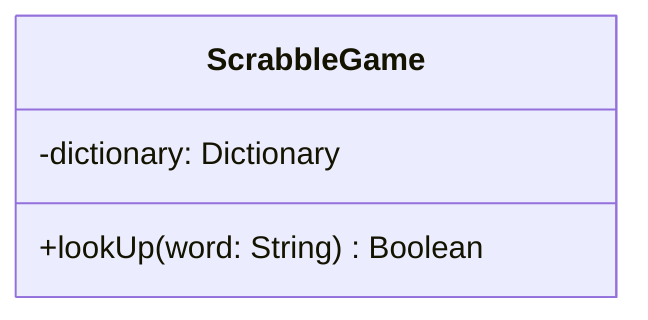

Note: either show role names or data fields, not both. Always show multiplicity.
eg *means 0 or more.
2..6 means [2,6] (between 2 and 6)
2..* means [2, infinity) (> 2)

If object is temperary (not stored), eg parameter or return type.

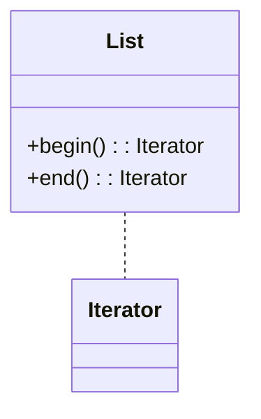

1. Composition relationship

- Also called "owns-a" relationship
- Implimented (in C++ as "composition")
  - Deep copy
- Once sub-object is bound, it cannot be shared and is destroyed when the main-object is destroyed.

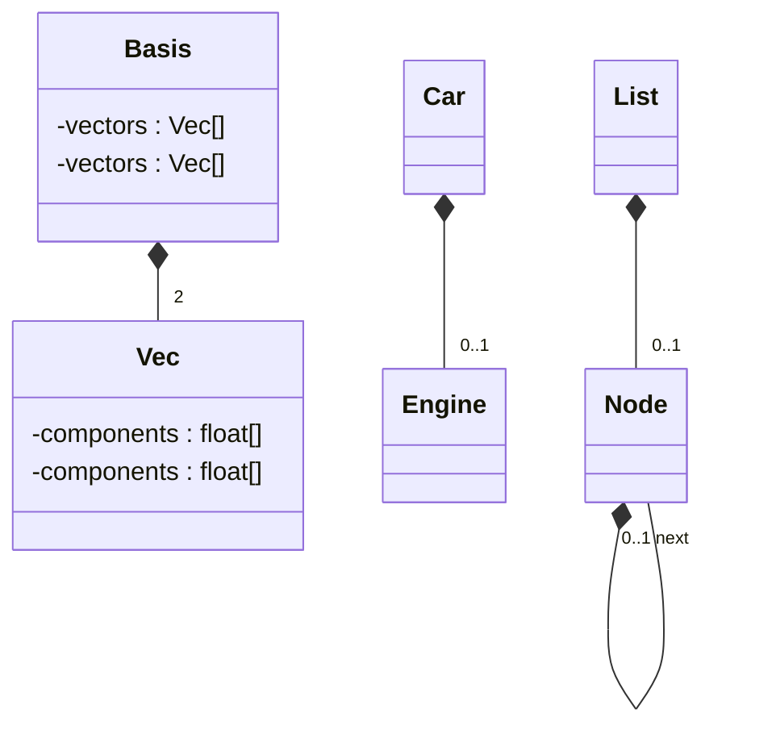

what does this mean?


This implies the owner (List) has to free each Node.

### Aggregation Relationship

Composition is "owns-a", aggregation is "has-a" relationship.

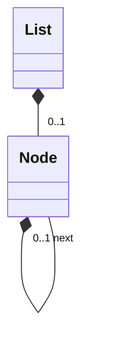

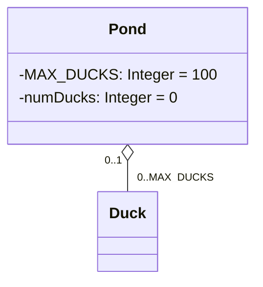

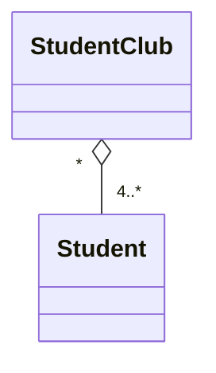

Aggregation does not imply ownership. Someone else is responsible for the creation and destruction of the aggragated object.
-Implimented using pointers. One object simply points to the other object, and has access to its data.
-Shallow copy

```cpp
class Duck {};

class Pond {
  inline static const MAX_DUCKS = 100; // inline lets initalize it inline
  int numDucks = 0;

  Duck* ducks[MAX_DUCKS]; // if multiplicity of was "*" need a dynamically sized array
  // ...
}
```

**(Exam) In order to make an array of objects, the obejct must have a ctor. But not true in this case since we are storing pointers to ducks.**

### Inheritance

AKA. Generalization or specilization. or "is-a".

Motivation example: User has a collection of books (novels), textbooks and comic books that they want to keep track of.

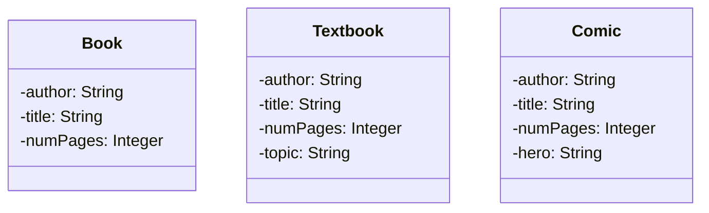

Lots of shared fields between these classes. C approach to storing array of these classes.

1. Array of (void*), then cast each address and store. (Not type safe, need a parrell data structure to store what is actualy at i-th index [+space and maintainance cost])
2. Tagged union

```c
enum class BookType {BOOK, TEXT, COMIC};
struct Book_Type {
  BookType bt;
  union item {
    Book *b;
    Text *t;
    Comic *c;
  }
}

Book_Type arr[100];
```

Cost of parallel data structure's space where tag **must** be correct, but union is more type safe.

C++ approach is to generalize (factor out) the common Book data fields.

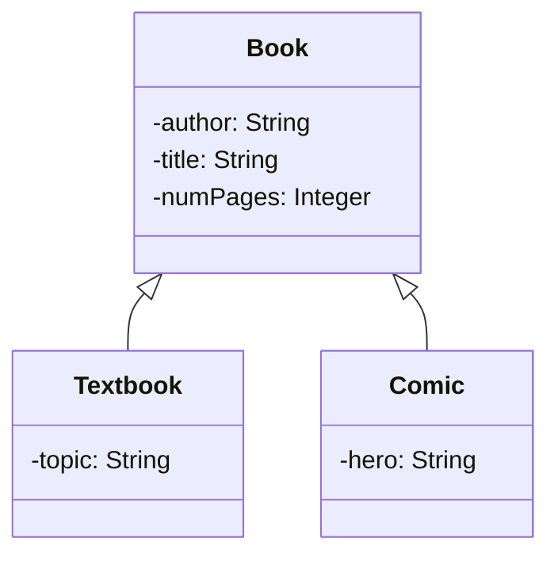

Do not:

- Show multiplicity
- Do not repeat methods/data unless giving a different implimentation (overridding)

`Book` is a parent, super class, base class.
`Textbook`, `Comic` is a child, sub class, derived class.

```cpp
class Book {
  std::string author, title;
  int numPages;

  public:
    Book(std::string author, std::string title, int np);
    // accessors
};

class Textbook: public Book {
  std::string topic;

  public:
    Text(std::string author, std::string title, int np, std::string topic);
}
```

**Note: child cannot view parents private data fields or call private methods.**
**Note: only child classes can view/access/mutate protected data/methods. This still breaks encapsulation so preference is still to have parents data fields private.**
**Note: Inheritance adds a step to object creation.**

```cpp
Text t{"stroustrup", "C++", 500, "C++"};
```

Object creatation steps:

1. Allocate object space (includes space for parent).
2. Initializa the parent portion, call the book ctor if not default ctor.
3. Call ctor's for all object data fields
4. Run ctor body

```cpp
Text t{"Fowler", "UML ...", 250, "UML"};
Book b = t; // object slicing
Book& bref = t; // no object slicing
Book* bptr = &t; // no object slicing

cout << bool alpha << b.isHeavy() << "\n" // Book::isHeavy->true, set staticaly, at compile time
     << bref.isHeavy() << "\n" // still calls Book::isHeavy->true
     << bptr->isHeavy() << "\n" // Book::isHeavy()->true
     << t.isHeavy() << endl; // Text::isHeavy()
```

In C++, the virtual keyword is used to enable runtime polymorphism — meaning the function that gets called is determined at runtime based on the actual object type, not the pointer/reference type.

**Why `virtual` Exists**
By default, C++ uses compile-time binding (static binding).
Without virtual, C++ decides which function to call based on the type of the pointer/reference, not the object.
With virtual, C++ uses dynamic dispatch — it calls the function of the derived class if the object is derived.

Example without virtual

```cpp
#include <iostream>
using namespace std;

class Animal {
public:
    void speak() {
        cout << "Animal sound\n";
    }
};

class Dog : public Animal {
public:
    void speak() {
        cout << "Bark\n";
    }
};

int main() {
    Animal* a = new Dog();
    a->speak();   // ❗ Calls Animal::speak
}
```

Output: Animal sound

Now with virtual:

```cpp
class Animal {
public:
    virtual void speak() {
        cout << "Animal sound\n";
    }
};

int main() {
  Animal* a = new Dog();
  a->speak();   // ✅ Calls Dog::speak
}
```

Output: Bark

#### What override Does

override (in the derived class) tells the compiler:
“This function MUST override a virtual function from the base class.”
If it doesn’t match exactly, the compiler gives an error.

#### Why override Is Important

Because C++ requires exact signature matching.
Even small differences mean you are NOT overriding — you’re creating a new function.
And without override, the compiler won’t warn you.

```cpp
class Animal {
public:
    virtual void speak() const {
        cout << "Animal\n";
    }
};

class Dog : public Animal {
public:
    void speak() {   // ❗ Missing const
        cout << "Bark\n";
    }
};
```

Non-standard UML warning: In this course we italicize all virtual methods, not just "pure virtual methods".

Can write
+isHeavy(): Boolean {abstract}
to denote virtual methods.

```cpp
Text t{"Fowler", "UML ...", 250, "UML"};
Book b = t; // object slicing
Book& bref = t; // no object slicing
Book* bptr = &t; // no object slicing

cout << bool alpha << b.isHeavy() << "\n" // Book::isHeavy = true
     << bref.isHeavy() << "\n" // Text::isHeavy = true
     << bptr->isHeavy() << "\n" // Text::isHeavy() = true
     << t.isHeavy() << endl; // Text::isHeavy()
```

This is polymorphism (many shapes)

```cpp
Comic c[2] = {{"a1", "t1", 10, "h1"}, 
              {"a2", "t2", 15, "h2"}};

void f(Book []b) {
  b[0] = Book{"ba1", "bt1", 200};
}

f(c);
```

`Error: c[0] has contents partially changed.`

Best practise is to use an array of pointers to the parent type, so there is no object slicing. Then use virtual methods when nessescary.

### Abstract Base Classes (ABC)

Goal: Parent (abstract base) class defines common data, interface (including virtual methods).
Want compiler to enfore that cannot create instances of the parent class.

Solutaion: add (at least 1) "pure" virtual method

```cpp
class Student {
  // ...
  public:
    virtual double calcTuition() const = 0; // Pure virtual
}

class MathStudent: public Student {
  public:
    virtual double calcTuition() const override {
      // ...
    }
}


Student s; // compilation error
Student* sptr = new MathStudent{};
```

Note: as soon as a method is declared to be pure virtual, even if its implimented (in the implimenation file) the compiler enforces that the client may not create instances of the ABC.

```cpp
class X {
  int* a;
  public:
    X(): a{new int[10]{0}} {}
    ~X() {delete []a;}
}

class Y: public X {
  int *b;
  public:
    Y(): b{new int[5]{0}} {}
    ~Y() {delete []b;}
}
```

Note: Best practise is to make destructor virtual if might inherit from (base) class.

Destructor sequence is now:

1. Run objects dtor body
2. Run parent class dtor
3. Run object data field dtors
4. Free object memory

Best practise: If want the classes to be an ABC but all methods have a reasonable (default) implimentation, make the dtor pure virutal.
Still needs to be implimented.

```cpp
class X {
  int* a;
  public:
    X(): a{new int[10]{0}} {}
    virtual ~X() = 0;
}
X::~X() {delete [] a;}
```

#### `Final` keyword

To state that a class cannot become a base class, use the final keyword. Enforced at compile time.

```cpp
class Y final: public X {
  // ...
}
```

To denote this in UML, underneath the title of Y, write "{leaf}"

```cpp
Book::Book(const Book& o): author{o.author}, title{o.title}, numPages{o.numPages} {}

Text::Text(const Text& o): Book{o}, topic{o.topic} {}
Book::Book(Book&& o): author{std::move(o.author)}, title{std::move(o.title)}, numPages{numPages} { // o is bound to rvalue but is lvalue

}
```

Parent class destructor runs after object data field destructors in inheritance steps of object destruction.

Q: What happens if `Book` (parent) class provides Big 5 but `Text` (child class) does not? (will be same for any of the 5.)

```cpp
Text t1 {...};
Text t2 {t1}; // ignoring elision
```

A: Compiler provides copy ctor for `Text`. Invokes parent copy ctor.

Move and copy assignment are problematic in regards to the subclasses.

```cpp
Book& Book::operator=(const Book& o) {
  if (this == &o) return *this;

  author = o.author;
  title = o.title;
  numPages = o.numPages;

  return *this;
}

Book& Book::operator=(Book&& o) {
  if (this == &o) return *this; // Not always needed

  author = std::move(o.author);
  title = std::move(o.title);
  numPages = o.numPages;

  return *this;
}

Text& Text::operator=(const Text& o) {
  if (this == &o) return *this;

  Book::operator=(o);
  topic = o.topic();
  return *this;
}

Text& Text::operator=(Text&& o) {
  Book::operator=(std::move(o));
  topic = std::move(o.topic);
  return *this;
}
```

Consider this:

```cpp
Text t1{...}, t2{...};
Book *bp1 = &t1, *bp2 = &t2;
*bp1 = *bp2; // both resolve to Text objects, but static type is (Book*) so Book copy assignment is called!
```

This situation is called "partial assignment".

Q: Can we fix this by making move and copy assignment virtual?  
A: No, we will focus on copy= but same issue for move=.

```cpp
class Book {
  // ...
  public:
    virtual Book& operator=(const Book& o); 
}

class Text: public Book {
  // ...
  public:
    virtual Text& operator=(const Text& o) override; // virual keyword optional here
    // This is an error occurding to override rules, since param of Text must be a Book
    // The return type is fine because of the "is-a" relationship

    // Would have to be (to override succesfully):
    // virtual Text& operator=(const Book& o) override;
}
```

So now `*bp1 =*bp2;` invokes `Text copy=` but illegal to have `t1 = Book{...}`

Note: o is no longer a Text object so its a compiler error to access o.topic.

```cpp
t1 = Book{...} // legal but wrong
Comic c {...};
t2 = c; // legal; sibling assignment
```

Solution 1: Set up hierarchy so that partial and mixed assignment are now compilation errors. Trade off is the loss of ability to say `*pb1 =*pb2;`. Introduce an ABC.

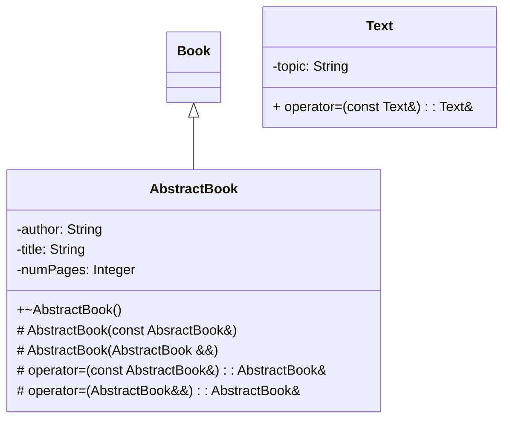

Note, cant create `AbstractBook` instances, and client cant use its = methods.

```cpp
Text t1{...}, t2{...};
Comic c1{...}, c2{...};
Book b1{...}, b2{...};
t1 = t2; // Good
t1 = c1 // erorr
b1 = c1 // error
c1 = b1 // error
```

Good practise: add ABC super class with protected copy/move ctors/= to prevent partial- and mixed - assignment (compilation errors).

```cpp
class AbstractBook {
  string author, title;
  int numPages;

  protected:
    AbstractBook(sgtring a, string t, int n);
    AbstractBook(const AbstractBook&);
    AbstractBook(AbstractBook&&);
    AbstractBook& operator=(const AbstractBook&);
    AbstractBook& operator=(AbstractBook&&);

  public:
    virtual ~AbstractBook() = 0;
}
```

```cpp
AbstractBook::~AbstractBook() {}

class Book: public AbstractBook {
  public:
    Book(...);
    Book(const Book&);
    ...
    Book& operator=(Book&&);
}
```

```cpp
Text::Text(const Text& o): AbstractBook{o}, topic{o.topic} {}

Text::Text(Text &&o): AbstractBook{std::move(o)}, topic{std::move(o.topic)} {}

Text& Text::operator=(const Text& o) {
  if (this == &o) return *this;
  AbstractBook::operator=(o);
  topic = o.topic;
  return *this;
}
```

### Templates

Templates in C++ let you write generic code — meaning code that works with any type, instead of just one specific type like int or double.
Instead of rewriting the same logic for multiple types, you write it once using a template parameter.

```cpp
int add(int a, int b) {
    return a + b;
}

double add(double a, double b) {
    return a + b;
}

// With templates
template<typename T>
T add(T a, T b) {
    return a + b;
}

// Works for 
add(3, 5);        // int
add(2.5, 4.1);    // double
```

Templates are resolved at compile time.
That means:
The compiler generates actual code for each type used.
It’s not runtime polymorphism.
It does not use virtual functions.

```cpp
template<typename T, typename U>
class Pair {
    T first;
    U second;

public:
    Pair(T f, U s) : first(f), second(s) {}
};

Pair<int, std::string> p(5, "hello");
```

Templates cannot be seperated into interface/implimentation files. Need the full implimentation in one shot.

### Vector

Part of the Standard template library (STL).
`import <vector>;`

```cpp
vector<int> v1; // empty vector
vector<int> v2{4, 5}; // v2 = {4, 5}
vector<int> v3(4, 5); // v3 = {5, 5, 5, 5}
vector<int> v4(4); // v4 = {0, 0, 0, 0}
vector<Vec> v5(4); // requires Vec to have default ctor, makes 4 default ctor objects
vector v6{4, 5, 6, 7}; // deduces instantiation type from value type

// dtor frees heap allocated memory
for (int i = 0; i < v6.size(); i++) {
  cout << v6[i] << " " << endl; // unsafe access
}
cout << v6.front() << " " << v6.back() << endl;
v6.pop_back(); // removes last item, void return type
v6.push_back(99); // old way

// A4
v5.emplace_back(0, 1); // Vec{0, 1}

auto it = v6.begin() + 3;
v6.erase(it); // removes the 4th item
// Note: adding/removing items from vector potentially damages iterator
v6.clear(); // clears the contents
```

Q: Consider a case where want to remove all occurances of `int 5` from a vector.  
A:

```cpp
// Soln 1: This is WRONG
for (auto it = v.begin(); it != v.end(); it++) {
  if (*it == 5) v.erase(it); 
}
```

Let say v points to array on the heap of [1, 2, 5, 5, 6, ...]. Once we hit the first 5, we erase the first location, so new array is [1, 2, 5, 6, ...]. But then our iterator goes to 6 next, we skip the next 5. This system does not work for consecutive 5's.
Problem 1: skips second 5.
Problem 2: if array "shrank", it is pointing into old array.

```cpp
// If we erase 5, then we will incriment it anyways, so we will skip the 5.
for (auto it = v.begin(); it != v.end(); ++it) {
  if (*it == 5) it = v.erase(it);
}

for (auto it = v.begin(); it != v.end();) {
  if (*it == 5) it = v.erase(it);
  else ++it;
}
```

### Design Patterns

- Class-level solution to common problems
- Adjust general framework
- Lets you program to the interface not the implimentation
- Uses inheritance alot

#### Iterator as a design pattern

```mermaid
classDiagram:
  
  class Iterator {abstract} {
    + operator*(): Iterator {abstract}
    + operator++(): Iterator {abstract}
    + operator!=(): Boolean
  }

  class List {abstract} {
    +addToFront(i: Integer)
    +ith(i: Integer): Integer
    +begin(): Iterator
    +end(): Iterator
  }
```

#### Observer

- also known as pub-sub
- 2 main variations for how state change info is retrived.
- Push (subject passes it with notification) or pull (observer retirves after notifications)

```mermaid
classDiagram:
  Subject --|> Observer 

  Subject (ABC) {
    +attach(o: Observer)
    +detach(o: Observer)
    +notifyAll()
  }

  Observer (ABC) {
    + notify()
  }
```

#### Decorator

Used when want to enhance an object dynamically, at run-time, add features or functionality.

You start with:

1. A base interface (abstract class)
2. A concrete implementation
3. A decorator base class that wraps the interface
4. Concrete decorators that add behavior

```cpp
import <iostream>;
import <string>;

class Pizza {
public:
    virtual std::string getDescription() const = 0;
    virtual double cost() const = 0;
    virtual ~Pizza() {}
};

class PlainPizza : public Pizza {
public:
    std::string getDescription() const override {
        return "Plain Pizza";
    }

    double cost() const override {
        return 8.0;
    }
};

class ToppingDecorator : public Pizza {
protected:
    Pizza* pizza;

public:
    ToppingDecorator(Pizza* pizza) : pizza{pizza} {}

    virtual ~ToppingDecorator() {
        delete pizza;
    }
};

class Cheese : public ToppingDecorator {
public:
    Cheese(Pizza* pizza) : ToppingDecorator{pizza} {}

    std::string getDescription() const override {
        return pizza->getDescription() + ", Cheese";
    }

    double cost() const override {
        return pizza->cost() + 1.5;
    }
};

class Pepperoni : public ToppingDecorator {
public:
    Pepperoni(Pizza* pizza) : ToppingDecorator{pizza} {}

    std::string getDescription() const override {
        return pizza->getDescription() + ", Pepperoni";
    }

    double cost() const override {
        return pizza->cost() + 1;
    }
};


int main() {
    Pizza* pizza = new Pepperoni(new Cheese(new PlainPizza()));

    std::cout << pizza->getDescription() << std::endl;
    std::cout << "Cost: $" << pizza->cost() << std::endl;

    delete pizza;
}
```

### STL std::map

`import <map>;`
Impliments a dictionary with key-value pairs (std::pair) where keys are unique. Key either defines an operator or client provides a comparitor function.

Usally implimented using red-black trees.

```cpp
map<int, string> m;
m[123] = "Joe";
m[456] = "Xiang";
if (m[678] == s); // m[678] inserts pair{678, ""}

// instead use 
if (m.count(678) == 1) cout << m[678] << endl;
m.erase(123); // pair with key 123

for (auto& el: m) { // el is an std::pair
  cout << "key: " << el.first << "; value: " << el.second << endl;
}
```

Since all fields in std::pair are public, can use a C++20 "structured binding"

```cpp
for (auto& [key, value]: m) {
  cout << "key: " << key << "; value: " << value << endl;
}
```

Can be used in struct/class where all data fields are public:

```cpp
Vec v{1, 2};
```

### Modules Revisited

So far, have been restricting ourselves to 1 class per module. But a module can hold many classes and functions.
Q: How do we decide?
A: Need to define 2 measures of software design quality, coupling and cohesion.

Coupling: Measure of interdependency between modules and classes.

Low to high coupling:

- Only form of communication is through function calls (data as parameters/results)
- Pass arrays/structs around
- modules effect each others control flow
- modules share global data
- modules access each others implimentation (friends)

Cohesion: How closely are module elements related to each other.

Low to high cohesion:

- Arbirtary grouping of unrelated elements eg. `<utility>`, `std::swap`, `std::min`
- Have a common theme, may share some base code, but otherwise unrelated `<algorithm>` (useful for project).
- elements manipulate objects state over its lifetime (eg. open/read/close files)
- elements pass data to each other
- elements cooperate to perform exactly 1 task

Goal: modules should exhibit low coupling and high cohesion.

Q: What if 2 classes depend on each other? (inheritance or composition)  
A: inheritance => same module

Composition also suggests the same module, but may have a dependancy cycle

```cpp
//impossible
class A {
  int x
  B y;
}

class B {
  char x;
  A y;
}
//impossible
// soltn: forward declaration, pick a datafield whose size is known before declaration (pointer or refereance)

class A; // forward declaration
```

Q: When must a class know the size of another class? (at compile time)  
A: When it is composed of it, or inherits from it?

Problem: Cannot forward declare a module or the information within another module.

- From the problem above both `A` and `B` must be in the same module.
- Makes sense since `A` and `B` are tightly/highly coupled.
- Must compile in dependency order for modules as well.

### Decoupling Interfaces (MVC)

Q: Consider a `ChessBoard` class that models the game state. Game may prompt player by printing to standard output and reading from standard input.  
But specificying streams isn't very flexible. Even worse if you want to add a GUI. `ChessBoard` keeps being impacted by I/O changes which have nothing to do with modeling game state

- 2 conflicting tasks
- leads us to the single responsibility principle, a class should only have 1 reason for change.

Q: Should IO go to main?  
A: Inhibits reusability better if in class.

Bring us to the MVC archetechirial pattern

- model represents the state.
- view is what the client sees and interacts with to effect the model.
- controller mediates between model and view
- may encode some rules

### Exceptions

- `std::vector<T>::at(int i)` checks that `i` is in the vectors range of indices.

```cpp
void f(vector<int>& v) {
  v.at(100000) += 1; // Raises std::out-of-range exception
}
```

If no code written to deal with exception, prgram aborts with unhandled exception error.
C error-handling approach relies on either function return values, or changing value in global error variable.
Programmer has to test but can't be forced.

- intermingles with error handling code with normal execution behavior.
- vector knows when range error occurs but not what to do about it. client knows what to do, but may not be able to detect exception. Client catches and handles exception, which may not be resolved totally or require exception to "propagate" further.

- C++ lets you throw anything as an exception. Prefer to use `<stdexcept>`

```cpp
void f() {
  throw out_of_range{"f"};
}
void g() {f();}
void h() {g();}

int main() {
  try {
    h();
    cout << "here" << endl;
  } catch(out_of_range& e) {
    cerr << e.what() << endl;
  }
  cout << "Done" << endl;
}
```

Stack process

main -> h -> g -> f

Then f throws the exception, so the stack unwinds.

- If each activation frame has no handlers, remove (destroys all local objects) frame and keep searching.
- If has handlers, look for closest match (if none and unwound main pgm stops with unhandled exception)
- If matches, execute handler code
  - If throw new exception (or reraise old) continue stack unwinding
  - Else continue after last handler in block chain.

```cpp
try {
  f();
} catch(...) {
  cout << "Caught something" << endl;
}
```

Since can throw an object, object may be part of inheritance heirarchy.

```cpp
Error e;
throw e; // Rasies an error
Error& e2 = BigError;
throw e2; // Raises an error

void f() {throw BigError;}
void g() {
  try {
    f();
  } catch (Error e) {...} // Catches BigError, but slices it into an Error
  // Better to catch by reference
}

void h() {
  try {
    f();
  } catch (Error& e) {... // Since BigError "is an" Error, this clause always gets hit
  } catch (BigError& e) {

  }
}
```

Rule: Order clauses from most to least specific.
Rule: Never let a destructor raise an exception!

### Exception Saftey

```cpp
void f() {
  C myc;
  C* cp = new C;
  g();
  delete cp;
}
```

Q: If no exception raised by `g()`, `f()` executes properly. What happens if `g()` raises an exception?  
A: Stack unwinding takes care of destructing local object `myC` (runs destructor), but won't execute delete.

Since after call to `g()`, so heap memory is leaked. Revise code:

```cpp
void f() {
  C myc;
  C* cp = new C;
  try {
    g();
  } catch (...) {delete cp; throw;}
  delete cp;
}
```

Issue: Code is awkward and duplicated.

Alternatives:

1. Use a langauge that supports finally clasue.
2. Use Resource Aquisition Is Initialization (RAII) idiom.

- Leverage the fact that local objects will always have their destructors run during stack unwinding.
- Resource aquired often in ctor but must be released by dtor.

Works with file streams, strings and vector all apply RAII!

```cpp
{
 ifstream in{"input.txt"};
 string s{"Hello world"};
 vector<int> v;
} // v, s, in, release resources and close file.
```

### Smart pointers

In modern C++, smart pointers are objects that manage dynamically allocated memory automatically. Instead of manually calling new and delete, smart pointers ensure memory is freed when it is no longer needed. This helps prevent:
 • Memory leaks
 • Dangling pointers
 • Double deletes

Smart pointers are part of the C++ Standard Library, specifically in the `<memory>` header.

The two most common ones are:
 • std::unique_ptr
 • std::shared_ptr

#### `std::unique_ptr`

A unique_ptr represents exclusive ownership of a dynamically allocated object.

```cpp
import <memory>;
void f() {
  C myC;
  unique_ptr<C> cp = new C;
  // alternate
  auto cp = make_unique<C>(); // make_unique takes in C's ctor params
}
```

Key properties:
 • Only one unique_ptr can own the object at a time
 • Cannot be copied
 • Can be moved
 • Automatically deletes the object when the pointer goes out of scope

```cpp
unique_ptr<C> p1 = new C;
unique_ptr<C> p2 = p1; // illegal copy
```

Consider an implimentation sketch of unique_ptr:

```cpp
template <class T> 
class unique_ptr {
  T* ptr;
public:
  explicit unique_ptr(T* p): ptr{p} {}
  ~unique_ptr() {delete ptr;}
  unique_ptr(const unique_ptr<T>& other) = delete;
  unique_ptr(unique_ptr<T>&& other): ptr{other.ptr} {
    other.ptr = nullptr;
  }
  unique_ptr<T>& operator=(const unique_ptr<T>& other) = delete;
  unique_ptr<T>& operator=(unique_ptr<T>&& other) {
    delete ptr;
    ptr = o.ptr;
    o.ptr = nullptr;
    return *this;
  }

  T* get() const {return ptr;}
  T& operator*() const {
    return *ptr;
  }
}
```

Q: If need to copy pointers (pass as parameter, return, etc), need to consider ownership. Implies things about implementation.  
A: Suggests only the owning object will have the unique ptr object. Everybody else works with the raw heap address (not owners). Transfer ownership if use move operations.

Note: Passing/returning by value transfers ownership.

```cpp
void f(unique_ptr<C> p);
// f becomes owner of p

unique_ptr<C> g();
// g loses ownership which is passed to receiver

void f(C* cp);
// no ownership transfer, dont even know if address is to stack or heap

C* h();
// no ownership transfer, could be shared
```

#### `std::shared_ptr`

A shared_ptr represents shared ownership of an object.

Multiple shared_ptrs can point to the same object, and the object is destroyed only when the last pointer releases it.

Internally it uses a reference count.

```cpp
#include <iostream>
#include <memory>

int main() {
    std::shared_ptr<int> p1 = std::make_shared<int>(10);

    std::cout << p1.use_count() << std::endl; // 1

    {
        std::shared_ptr<int> p2 = p1;
        std::cout << p1.use_count() << std::endl; // 2
    }

    std::cout << p1.use_count() << std::endl; // 1
}
```

### Factory Design Pattern

Provides an interface for creation. Encapsulates creation rules.

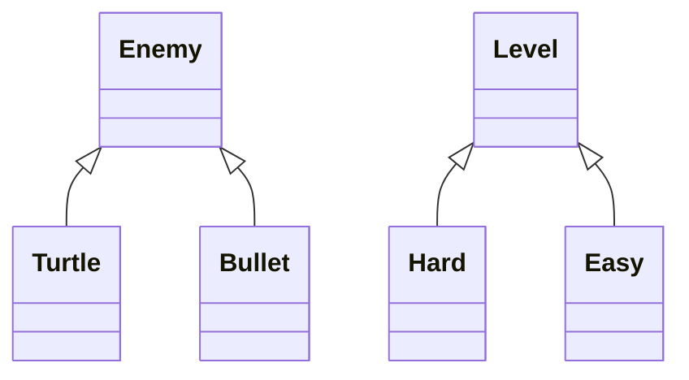

```cpp
class Level {
  public: virtual Enemy* create() = 0;
}
```

### Template Method cont

Q: Consider a `Turtle` base class with a `draw()` method that calls methods `drawHead`, `drawFeet`, `drawShell`. How should the class be structered?  
A:

```cpp
// version 1
class Turtle {
  public:
    virtual draw() const;
    virtual drawShell() const;
    virtual drawHead() const;
    virtual drawFeet() const;
}
```

Problem 1:

- all methods are public can be called by mutant turtles.
- `public` implies client interface if meet preconditions, post conditions will be met and class invariants preserved
- not preserved since everything is public

Problem 2:

- virtual methods can be overridden by children can change the process/algorithm
- violate assertions

Solution: only `draw` should be public, rest of methods should be at least protected, if not private. Should make these methods virtual those that need overridden.

```cpp
class Turtle {
  virtual drawShell() const;
  virtual drawHead() const;
  virtual drawFeet() const;
  public:
    void draw() const {
      drawShell();
      drawHead();
      drawFeet();
    }
}
```

Template method uses the Non-Virtual Interface idiom (NVI) but doesn't necessarily follow it completely.
NVI idiom

- no public methods (except dtor) should be virtual
- virtual methods should be protected (or private) and wrapped by a non-virtual method call.

Benifits:

- have complete control over client interface from the start
- easier to grant further access later than remove already granted access
- easy to customize wrapper methods by adding code before/after call to virtual methods without affecting client.
- a good compiler can optimize out the extra (wrapper) calls
- no downside to using it

Best practise: use NVI idiom
eg.

```cpp
class DigitalMedia { // without NVI
  public: 
    virtual void play() = 0;
}

class DigitalMedia { // with NVI
  virtual void doPlay() = 0;
  public:
    void play() {
      // can add more method calls to display cover, 
      // incriment song count, and do other logic within play.
      doPlay();
      // further customization
    }
    virtual ~DigitalMedia();
}
```

### Back to Exception Saftey

Q: What is exception saftey?  
A: Doesn't mean that no exceptions are ever raised, nor that all exceptions are caught. It does mean that the program is left in an "unbroken" (valid) state once an exception is raised. Use the call to some function `f` that could raise an exception

1. Basic exception level saftey guarantee:
The program after the exception is raised, is in some valid but unspecified state.

    - no data is corrupted, no memory is leaked, all class invariants maintained.

2. Strong exception saftey level guarantee: meets constraints of basic plus must be as if call to `f()` never happened.
**Note: may not be able to undo all effect of f() if f() had side effects, eg wrote output**

3. No-throw exception saftey level guarantee: no exceptions propagate from `f()` and must guarantee that `f()` succeeds.

Consider the following example:

```cpp
class A {...}; // A::g();
class B {...}; // B::h();
// a.g() and b.h() might raise exceptions

class C {
  A a;
  B b;
  public: 
    void f() {
      a.g();
      b.h();
    }
}
```

Q: What can be reasoned about `C::f`'s exception saftey-level guarantee if `A` and `B` provide no exception saftey level guaantees?  
A: Nothing. (no guarantees)

Q: What if both provide basic exception saftey level guarantees?  
A: If `a.g()` raises, `f` starts unwinding and are in basic exec saf lev guar. If `b.h()` raises, don't know if changing a but not changing b leaves us in a valid state or not

- insufficient info

Q: What is A + B offer strong exec saftey lev guarantees? (assume no non-local side effects)  
A: If `a.g()` raises as if call never made

- f unwinds and meets strong exec saf lev g.

if `b.h()` raises, `f()` can meet strong ex saf lev, if g can undo changes to a

- can be done if use something similar to copy-swap idiom

```cpp
void C::f() {
  A mya{a}; // deep copies, if fails std::bad_alloc unwinds and local object
  B myb{b};

  mya.g(); // if raises unwinds
  mya.h(); // same here
  a = mya; // if fails, have partially changed a and b;  
  b = myb;
}
```

Note: copying numbers which includes memory addresses, cannot fail.

- levergae the pointer to implimentation (PImpl) idiom

```cpp
struct CImpl {
  A a;
  B b;
};

class C {
  unique_ptr<CImpl> pImpl;
  public: 
    C() {pImpl = make_unique<CImpl>();}
    void f() {
      auto temp = make_unique<CImpl>(*pImpl); // copy ctor
      // if fails, f unwinds => strong e s l g.

      temp->a.g(); // if throws only changed temp => strong
      temp->b.h(); // ditto
      std::swap(temp, pImpl) // uses std::move to exchange ownership
      // cant fail
    }
}

```

### Exception saftey and std::vector

- Since `std::vector` uses a heap-allocated array, implimented RAII since destructor frees the array.

```cpp
void f() {
  vector<C> v; // when v goes out of scope, C dtor's will run
}

void g() {
  vector<C*> v; // v's dtors will not free pointers 
                // Not owner, if owner must manually free heap memory
                // if the C objects are owned, should use smart pointers
  vector<unique_ptr<C>> c;
}
```

Now, `std::vector::emplace_back()` offers the strong exception saftey.

Consider cases:

1. Have space then create object "in place". If fails, object not created, vector unchanged.
2. If don't have space, create new heap array and copy over old objects via copy ctor calls. (If copy ctor fails, only changed temp, then stack unwinds so strong e.s.l.g). (if copy ctor didn't fail, swap array addresses which cannot fail. Then delete old array which also cant fail since declared no throw)

Q: Can we use move operations instead?
A: Only if can guarantee that they meet the "no throw" exception saftey level guarentee; otherwise uses copy semantics.

Best practise: Mark move operations as "no throw" using `noexcept`. Eg `C(C&& c) noexcept; C& operator(C&& c) noexcept;`

### Casting

- C casting isn't strongly type safe

```c
int i = 5;
float f = 3.14159;
i = (int)f;
```

C++ has 4 keywords for (basic) casting

1. `static_cast`: when you are sure that the cast will succeed. Must be a reasonable cast. Undefined behavior if it fails.

  ```cpp
  int main() {
      double x = 3.7;
      int y = static_cast<int>(x);  // converts double → int (truncates)

      cout << y << endl;  // prints 3
  }
  ```

1. `reinterpret_cast`: unsafe, implementation-dependant, "weird" conversions. Most of the time the behavior is undefined.

```cpp
Student s;
Turtle* tp = reinterpret_cast<Turtle>(&s)
```

1. `const_cast`: used to convert between const and non-const. non-const to const is ok. const to non-const is questionable.

2. `dynamic_cast`: only works on pointers/references to classes with at least 1 virtual method since relies on underlying runtime type information (RTTI). Used for tentative conversions that might fail.

```cpp
Book* bp = new Comic;
Text* tp = dynamic_cast<Text*>(bp);
if (tp != nullptr) cout << tp->getTopic();
```

Q: What about references? No such thing as a "null" object to which the reference can be bound.
A: Raises `std::bad_cast` in cast of failure.

```cpp
try {
  Text t{...};
  Book& b = t;
  Comic& cref = dynamic_cast<Comic&>(b);
  cout << cref.getHero() << endl;
} catch (bad_cast& e) {}
```

Q: Can we cast smart pointers?
A: Only `std::shared_ptr` can be cast.
`static_pointer_cast`, `reinterpret_pointer_cast`, `const_pointer_cast`, `dynamic_pointer_cast`.

### Copy and move revisited

Can now use dynamic cast to solve move/copy assignment. Partial- and mixed- assignment now caught at run-time, not compilation. But can now do assignment using dereferenced base class pointers.

```cpp
// Book hierarchy without ABC
Text& Text::operator=(const Book& o) {
  Text& tother = dynamic_cast<Text&>(o);
  if (this == &tother) return *this;
  Book::operator=(o);
  topic = tother.topic;
  return *this;
}
```

Q: Is dynamic casting good style?
A: Consider the following:

```cpp
void whatIsIt(shared_ptr<Book> b) {
  if (dynamic_pointer_cast<Comic>(b)) cout << "Comic";
  else if (dynamic_pointer_cast<Text>(b)) cout << "Text";
  else if (b) cout << "Book";
  else cout << "Nothing";
}
```

This code highly/tightly coupled to the Book hierarchy and must be changed if classes are added. Need to fix all dynamic cast instances and might miss some.
But dont need to change dynamic casts in move/copy assignments.

Q: Can we reduce the coupling in `whatIsIt`?  
A: Yes, we can introduce a virtual method in base class overridden by all subclasses.

```cpp
class Book {
  public:
    //...
    virtual void identify() const { cout << "Book";}
}

class Text: public Book {
  public: 
    virtual void idenitfy() const override {cout << "Text";}
}

void whatIsIt(Book* bp) {
  if (bp) bp->identify();
  else cout << "Nothing";
}
```

Q: When is inhieritance a good (or bad) idea?  
A: Good idea if interface are uniform across all of the classes and could have an infinite # of classes in the hierarchy.
